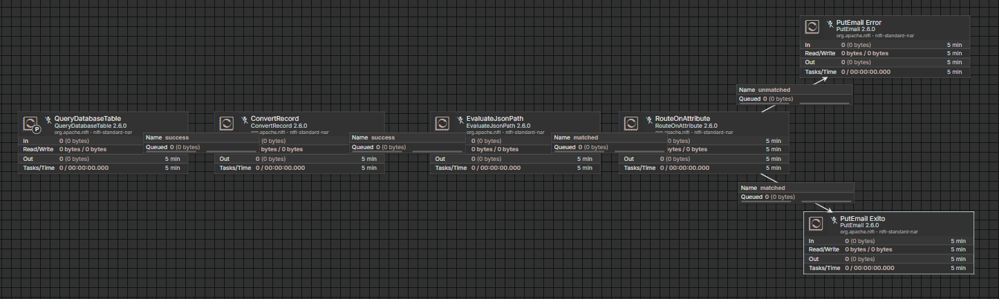
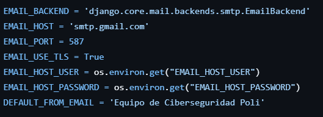
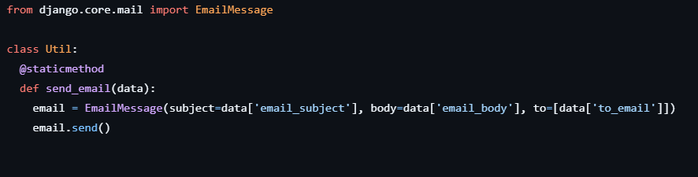

# 1. Apache NiFi

Apache NiFi es un sistema administrar para flujos de datos entre sistemas, a través de lógica que se gestiona de forma visual. Sirve para hacer grafos de enrutamiento de datos escalables y transformables. Se basa en su interfaz de usuario para controlar dichos flujos de datos, y está diseñado para enfrentar los problemas que pueden ocurrir en flujos de datos, como fallos en el sistema, limitaciones regulatorias y de negocio, entre muchas otras. Sirve para manejar datos, convertirlos, transformarlos y manipularlos a través de los sistemas que tiene integrados.

Apache NiFi se basa en varios componentes en los cuales se controlan los flujos de datos, entre los cuales se incluyen:

- **FlowFiles:** son los paquetes de información que se mueven en el sistema.
- **Processors:** son los puntos donde se hacen los trabajos, entre los cuales se involucra enrutar, transformar datos, etc.
- **Connections:** son el vínculo entre processors; actúan como colas y se pueden priorizar y limitar.
- **Controllers:** saben como se conectan los procesos y gestionan los hilos de los mismos.
- **Groups:** son como una red; son conjuntos específicos de procesos con sus conexiones.

Apache NiFi se puede usar en este proyecto de paquetes gracias a que se puede conectar a una base de datos SQL y recoger datos. Una vez recogidos, los puede transformar a JSON (normalmente vienen en formato Avro), puede tomar decisiones según estos datos, enrutarlos, entre otras opciones. Puede mandar correos, ponerlos en archivos, insertarlos en la misma u otra base de datos, etc.

---

## Ejemplo de uso para LogiTrack para mandar correos

1. Pone un **QueryDatabaseTable** como procesor para tomar filas de la base de datos después de que se incrementan (periódicamente).
2. Estos datos son recibidos por un **ConvertRecord** para que sean transformados de Avro a JSON.
3. Usa **EvaluateJsonPath** para leer el campo y sacar un atributo.
4. Según el atributo anterior, enruta con **RouteOnAttribute**, y si es exitoso, manda un email de éxito. Si no, manda un email de error. Ambos se mandan con **PutEmail** diferentes.

---

# 2. Enviar correos con SendGrid

Afortunadamente, Django simplifica mucho las cosas a la hora de enviar correos. Solo hay que poner algunas configuraciones básicas como el servidor, puerto, entre otros, y de esta manera se enviará el correo. Estas configuraciones se especifican en el `settings.py` del proyecto (`/app_backend/app_backend/settings.py`). Una de estas es el `EMAIL_HOST`, que sería `'smtp.sendgrid.net'`. Aquí hay una imagen sobre las configuraciones pertinentes.

### Explicación de cada variable:

- **EMAIL_BACKEND:** especifica que Django va a ser el backend para mandar estos correos (afortunadamente viene integrado)
- **EMAIL_HOST:** especifica el servicio de correo SMTP que envía los correos (en este caso, Google).
- **EMAIL_PORT:** puerto estándar para SMTP (587)
- **EMAIL_USE_TLS:** encriptación del correo
- **EMAIL_HOST_USER:** el usuario de correo que manda el mismo (dirección de correo electrónico)
- **EMAIL_HOST_PASSWORD:** contraseña para acceder al usuario. En este caso, tuve que generar una contraseña para aplicación desde el correo de Google.
- **DEFAULT_FROM_EMAIL:** el nombre que sale de quien envía el correo.

Posteriormente, se llama el método correspondiente para mandar un correo, y luego, Django hace el resto.

La manera en la que la implementé en las imágenes mostradas es de un proyecto llamado **CiberseguridadPoli**.

Si por alguna razón fallara la API de correos, especificaría un servidor de correo diferente temporalmente, como el de Google (`smtp.gmail.com`). Esto también puede lograrse estableciendo las configuraciones de correo justo al momento de enviar el correo.

---

## Fuentes consultadas:

[https://nifi.apache.org/components/](https://nifi.apache.org/components/)
[https://nifi.apache.org/documentation/v1/](https://nifi.apache.org/documentation/v1/)
[https://www.youtube.com/watch?v=SpdXbpukh5E](https://www.youtube.com/watch?v=SpdXbpukh5E)
[https://nifi.apache.org/docs/nifi-docs/components/org.apache.nifi/nifi-standard-nar/1.4.0/org.apache.nifi.processors.standard.QueryDatabaseTable/index.html](https://nifi.apache.org/docs/nifi-docs/components/org.apache.nifi/nifi-standard-nar/1.4.0/org.apache.nifi.processors.standard.QueryDatabaseTable/index.html)
[https://nifi.apache.org/docs/nifi-docs/components/org.apache.nifi/nifi-standard-nar/1.5.0/org.apache.nifi.processors.standard.ConvertRecord/index.html](https://nifi.apache.org/docs/nifi-docs/components/org.apache.nifi/nifi-standard-nar/1.5.0/org.apache.nifi.processors.standard.ConvertRecord/index.html)
[https://nifi.apache.org/docs/nifi-docs/components/org.apache.nifi/nifi-standard-nar/1.6.0/org.apache.nifi.processors.standard.EvaluateJsonPath/index.html](https://nifi.apache.org/docs/nifi-docs/components/org.apache.nifi/nifi-standard-nar/1.6.0/org.apache.nifi.processors.standard.EvaluateJsonPath/index.html)
[https://nifi.apache.org/docs/nifi-docs/components/org.apache.nifi/nifi-standard-nar/1.6.0/org.apache.nifi.processors.standard.RouteOnAttribute/index.html](https://nifi.apache.org/docs/nifi-docs/components/org.apache.nifi/nifi-standard-nar/1.6.0/org.apache.nifi.processors.standard.RouteOnAttribute/index.html)
[https://nifi.apache.org/docs/nifi-docs/components/org.apache.nifi/nifi-standard-nar/1.17.0/org.apache.nifi.processors.standard.PutEmail/index.html](https://nifi.apache.org/docs/nifi-docs/components/org.apache.nifi/nifi-standard-nar/1.17.0/org.apache.nifi.processors.standard.PutEmail/index.html)
[https://www.twilio.com/docs/sendgrid/for-developers/sending-email/django](https://www.twilio.com/docs/sendgrid/for-developers/sending-email/django)
