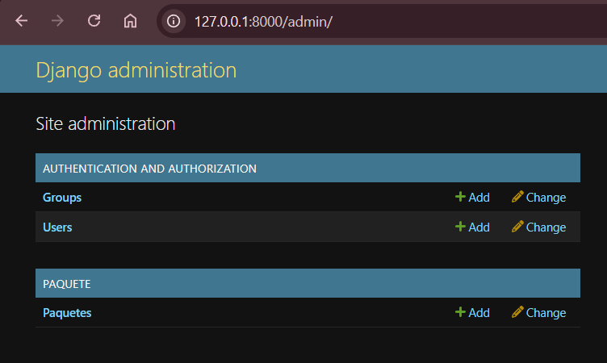
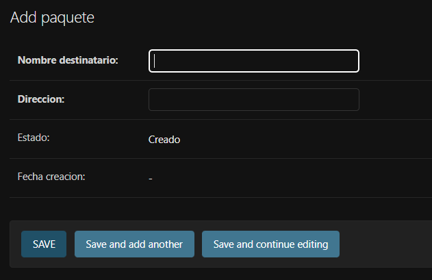
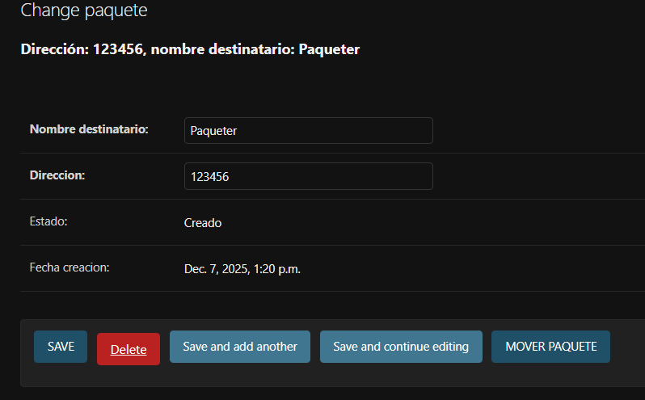
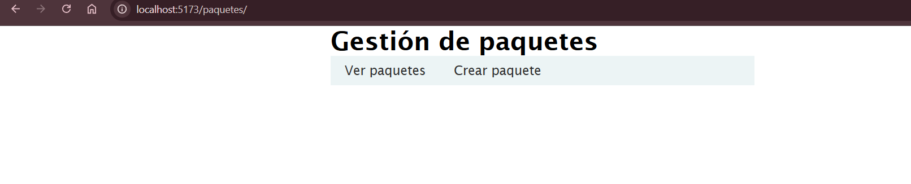
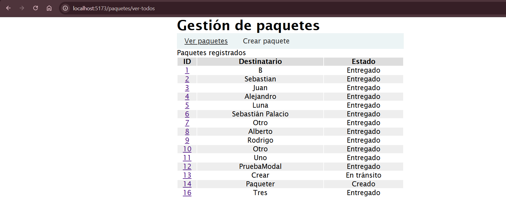
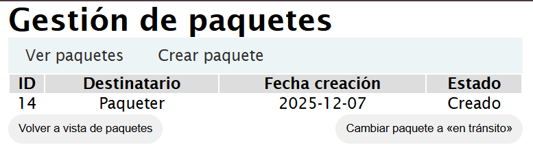
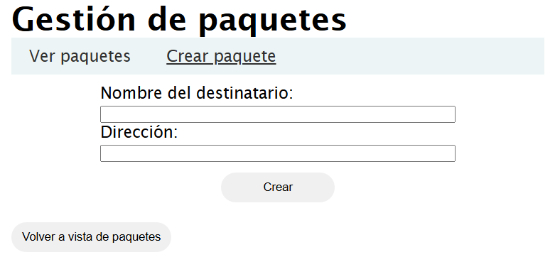

# Bienvenidos a LogiTrack, sistema de gestión de paquetes

Puedes crear un paquete, verlo y cambiar los estados del paquete. Recuerda que solo puedes pasar de «Creado» a «En tránsito», y de «En tránsito» a «Entregado». No se puede seguir un flujo diferente ni devolverse entre estados.

---

## ¿Qué tecnologías/herramientas/bibliotecas usa este proyecto?

Este proyecto usa herramientas libres para el front-end y back-end. Las herramientas que usa son las siguientes:

### Lenguajes de programación:

- Python
- JavaScript

### Frameworks/Bibliotecas:

#### Back-end:

- Django
- Django REST framework
- Django CORS headers
- Y otras herramientas que vienen por defecto (como sqlparse).

#### Front-end:

- React (A través de Vite)
- Axios
- React Router

---

## ¿Cómo se usa el proyecto?

Teniendo en cuenta que el proyecto no está desplegado en la nube, para usarlo de manera local se requiere tener instalado Python y Node.js en tu computador. Las versiones de Python y Node.js usadas son **3.13.2** y **22.13.0**, respectivamente. Una vez instaladas estas herramientas, debes clonar el proyecto y acceder a su respectiva carpeta. Dentro de la carpeta del proyecto clonado, debes hacer lo siguiente:

---

## Activación del back-end

Dentro de la carpeta descargada, abre la terminal e introduce los siguientes comandos.

### `python -m venv venv`

Crea el entorno virtual para aislar dependencias y evitar conflictos (solo se ejecuta este comando la primera vez).

### `.\venv\Scripts\activate`

Activa el entorno virtual.

### `cd .\app_backend\`

Se cambia la ubicación a la raíz del backend.

### `pip install -r requirements.txt`

Instala todas las bibliotecas de Python usadas para este proyecto.

### `python manage.py runserver`

Inicia el servidor de Django (por defecto en el localhost:8000).

---

## Activación del front-end

En otra terminal, dentro de la carpeta `app_frontend`
(desde la raíz del proyecto: `cd .\app_frontend`) introduce los siguientes comandos:

### `npm install`

Instala las dependencias de la plantilla de Vite + React.

### `npm run dev`

Inicializa el servidor front-end (por defecto en el localhost:5173).

**Nota:** la aplicación funciona con los puertos por defecto. Si se usan otros, también se debe configurar directamente en la aplicación.

---

## Ejemplo de uso

Dirígete a `http://127.0.0.1:8000/admin/` y verás lo que se muestra en la siguiente imagen:

Introduce lo siguiente en sus respectivos campos:

- **Username:** administrador
- **Password:** Admin1234\*

Una vez introduzcas estos datos y le des a «Log in», puedes ver el panel de administrador y editar los paquetes. Groups y Users vienen por defecto en Django. Puedes ignorarlos si deseas.

Puedes darle «add» para agregar un paquete y te enviará a lo que se muestra en la siguiente imagen:

Los campos de «Estado» y «Fecha creación» no se pueden modificar al crear el paquete. El campo de estado solo se puede modificar en el formulario que se ve en la siguiente imagen:

Sin embargo, la opción de mover está disponible solo si la transición lo permite; si ya está en entregado, no va a salir el botón.

---

Todo esto es para editar desde el backend. Sin embargo, la aplicación se hizo para poder manejarse desde un frontend. Para usar el frontend, dirígete a `http://localhost:5173/` y verás lo que se muestra en la siguiente imagen:

Aquí, podrás entrar a «Ver paquetes» o «Crear paquete». Al usar la opción para ver paquetes, se mostrará lo siguiente:

Puedes dar clic en cada ID para consultar el paquete por individual, y podrás ver algo como lo siguiente:

La opción de «Cambiar paquete a «en tránsito»» solo estará disponible si lo permite el flujo de transiciones. También puedes crear un paquete en el formulario de «Crear paquete» y verás lo siguiente.

